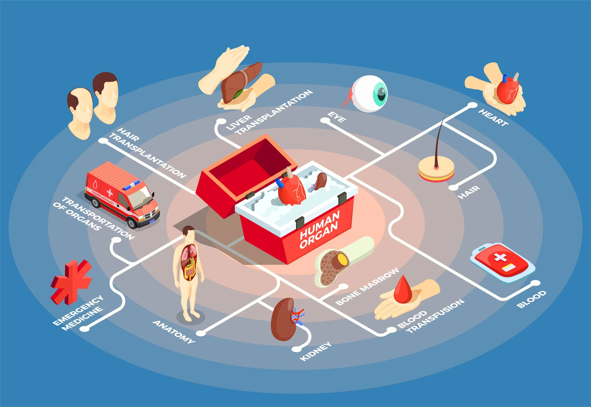

# 4.2.2 Organ Transplantation

## 1. What is organ transplantation?

<p align="center">
  
</p>

**Organ transplantation** is a medical procedure in which a functional organ or organ-containing tissue is transferred from a **donor** to a **recipient** to replace an organ that is damaged or no longer functioning adequately.

In simple terms, transplantation replaces a failing biological organ with a functioning one obtained from another source.

Commonly transplanted organs include:

* kidney,
* liver,
* heart,
* lung,
* pancreas,
* and intestine.

Some tissues, such as corneas and certain types of bone or skin tissue, can also be transplanted, although they are not complete organs.

The central objective is:

$$
\boxed{\text{Replace failed organ} \rightarrow \text{restore essential biological function}}
$$

---

## 2. Why is organ transplantation needed?

Organs can become severely damaged because of:

* chronic disease,
* genetic disorders,
* infection,
* injury,
* congenital abnormalities,
* or progressive loss of organ function.

When an organ can no longer perform its essential function, treatment may eventually require replacement.

For example:

* Severe kidney failure may require kidney transplantation.
* Severe liver failure may require liver transplantation.
* Advanced heart failure may require heart transplantation.

Transplantation can therefore provide a major improvement in survival and quality of life for appropriately selected patients.

However, transplantation has a fundamental limitation:

> **The supply of suitable donor organs is much smaller than the demand.**

This shortage is one of the major reasons why tissue engineering and organ engineering are being investigated as potential alternatives or complementary approaches.

---

## 3. Basic transplantation process

A simplified transplantation process is:

```text id="q8v8m4"
Donor organ
     ↓
Organ retrieval
     ↓
Preservation
     ↓
Compatibility assessment
     ↓
Recipient surgery
     ↓
Blood vessels / structures connected
     ↓
Organ begins functioning
     ↓
Post-transplant monitoring
```

The process is considerably more complex in practice, but this sequence captures the basic concept.

---

## 4. Types of organ transplantation

Transplantation can be classified according to the **genetic relationship between donor and recipient**.

Understanding this classification is important because genetic similarity affects the immune response.

### 4.1 Autotransplantation

An **autotransplant** involves transferring tissue or an organ part from one location of a person's body to another location in the **same individual**.

Therefore:

$$
\text{Donor} = \text{Recipient}
$$

Because the tissue originates from the same person, immune rejection is generally not the central problem associated with genetic incompatibility.

Examples include certain tissue-transfer procedures.

### 4.2 Isotransplantation

An **isotransplant** occurs between **genetically identical individuals**, such as identical twins.

Because of their very close genetic similarity, the immune compatibility can be much greater than in transplantation between genetically different individuals.

### 4.3 Allotransplantation

An **allotransplant** occurs between two **genetically different individuals of the same species**.

This is the most common category for conventional human organ transplantation.

For example:

$$
\text{Human donor} \rightarrow \text{different human recipient}
$$

Because the donor and recipient are genetically different, the recipient's immune system may recognize the transplanted organ as foreign.

This creates the problem of **immune rejection**.

### 4.4 Xenotransplantation

A **xenotransplant** involves transplantation between **different species**.

For example:

$$
\text{Animal tissue} \rightarrow \text{human recipient}
$$

Xenotransplantation is being investigated as a possible way of addressing the shortage of human donor organs, but it involves substantial biological and immunological challenges.

---

## 5. Immune rejection

The most important biological challenge in organ transplantation is **immune rejection**.

The **immune system** protects the body by identifying and responding to foreign or abnormal biological material.

When a transplanted organ comes from another genetically different individual, the recipient's immune system may recognize molecules on the donor cells as foreign.

This can initiate an immune response against the transplanted organ.

Conceptually:

```text id="7v4x5j"
Donor organ
     ↓
Donor-associated molecular markers
     ↓
Recognized by recipient immune system
     ↓
Immune activation
     ↓
Damage to transplanted tissue
     ↓
Reduced organ function
```

This is why compatibility testing and immunosuppressive treatment are important in transplantation.

---

## 6. Immunosuppression

**Immunosuppression** is the reduction or suppression of immune-system activity using drugs or other medical approaches.

After many organ transplants, recipients require immunosuppressive therapy to reduce the risk of rejection.

The principle is:

$$
\text{Immune activity}
\downarrow
\quad\Rightarrow\quad
\text{Reduced probability/severity of rejection}
$$

However, suppressing the immune system also has disadvantages because immune responses are important for protection against infections and abnormal cells.

Thus, transplantation involves a balance:

```text id="50x7wh"
Too little immunosuppression
        ↓
Greater rejection risk

Too much immunosuppression
        ↓
Greater susceptibility to infections
and other complications
```

Therefore, the objective is not simply to eliminate immune activity but to achieve an appropriate balance.

---

## 7. Organ compatibility

Before transplantation, donor and recipient compatibility must be assessed.

Important considerations include:

* blood group compatibility,
* immunological characteristics,
* tissue matching,
* and the presence of antibodies that may react against donor tissues.

### Blood group compatibility

The ABO blood group system is an important consideration in many transplant situations because incompatible blood-group antigens can trigger immune reactions.

### Tissue compatibility

**Human leukocyte antigens (HLAs)** are cell-surface molecules involved in immune recognition.

Differences between donor and recipient HLA profiles can influence the immune response.

Better matching can reduce certain immunological risks, although perfect matching is not required for every transplant.

---

## 8. Organ preservation

Once an organ is removed from a donor, it is no longer receiving its normal blood supply.

The organ must therefore be preserved carefully until transplantation.

A major concern is **ischemia**.

**Ischemia** is a condition in which tissue receives insufficient blood supply.

Without adequate oxygen and nutrients, cells begin to become damaged.

The general sequence is:

```text id="rvwclb"
Blood supply interrupted
        ↓
Reduced oxygen/nutrient delivery
        ↓
Cellular stress
        ↓
Tissue damage
        ↓
Reduced organ viability
```

Therefore, organ preservation aims to minimize damage during the period between organ retrieval and transplantation.

This period is commonly described in terms of **ischemia time**.

---

## 9. Surgical transplantation

During transplantation, the donor organ is placed into the recipient's body and must be connected to the appropriate anatomical structures.

For a vascularized organ, this generally includes connecting:

* arteries,
* veins,
* and other necessary anatomical structures.

The objective is to restore blood circulation to the transplanted organ.

Conceptually:

```text id="b2x4rm"
Recipient blood vessel
        │
        ▼
   Transplanted organ
        │
        ▼
Recipient blood vessel
        ↓
Restored circulation
```

Once blood flow is restored, the organ can receive oxygen and nutrients.

The exact surgical procedure depends on the organ being transplanted.

---

## 10. Major challenges of organ transplantation

### 10.1 Donor organ shortage

This is one of the most significant challenges.

The number of patients requiring transplantation can exceed the number of suitable organs available.

This creates a major motivation for:

* organ engineering,
* regenerative medicine,
* artificial organ development,
* and alternative transplantation strategies.

### 10.2 Immune rejection

The recipient's immune system may attack the transplanted organ.

This can reduce organ function and, in severe cases, result in graft failure.

### 10.3 Immunosuppressive treatment

Long-term immunosuppression may be necessary for many recipients.

Although it reduces rejection risk, it can increase susceptibility to infections and produce other complications.

### 10.4 Organ preservation

The organ must remain viable between retrieval and transplantation.

Longer preservation periods generally increase the challenge of maintaining organ quality.

### 10.5 Surgical complications

Transplantation is major surgery and can involve complications related to:

* bleeding,
* infection,
* vascular connections,
* organ function,
* and other surgical factors.

---

## 11. What is a graft?

A **graft** is tissue or an organ that is transplanted from one location or individual to another.

The transplanted organ is therefore often referred to as a **graft**.

For example:

$$
\text{Donor kidney} \rightarrow \text{kidney graft}
$$

The recipient's immune response against the transplanted graft is called **graft rejection**.

This terminology is useful in examination answers.

---

## 12. Acute and chronic rejection

Rejection can occur in different patterns.

### 12.1 Acute rejection

**Acute rejection** generally develops over a relatively short period after transplantation and involves an active immune response against the transplanted organ.

It can lead to impaired organ function and requires medical management.

### 12.2 Chronic rejection

**Chronic rejection** develops over a longer period and involves progressive changes that can gradually reduce graft function.

The distinction is:

| Acute rejection | Chronic rejection |
| --- | --- |
| Develops relatively rapidly | Develops over a longer period |
| Strong active immune processes can contribute | Progressive long-term graft injury |
| Can cause relatively rapid decline in function | Gradual decline in graft function |

The exact mechanisms are complex and can vary among organs.

---

## 13. Transplantation and bioengineering

At first, organ transplantation may appear to be mainly a medical and surgical topic. However, it has a strong connection with bioengineering.

Bioengineering contributes to transplantation through areas such as:

* organ preservation,
* biomaterials,
* artificial organs,
* tissue engineering,
* organ engineering,
* bioprinting,
* medical imaging,
* monitoring systems,
* and surgical technologies.

The relationship can be represented as:

```text id="6y5w8p"
Organ transplantation
        │
 ┌──────┼────────┐
 ↓      ↓        ↓
Preser- Biomate- Tissue/
vation  rials    organ engineering
 │       │        │
 ↓       ↓        ↓
Better  Better   Potential
graft   device   alternatives
survival compatibility
```

Thus, bioengineering can improve conventional transplantation while also attempting to develop alternatives to donor organs.

---

## 14. Relationship between organ transplantation and organ engineering

This distinction is particularly important within **Unit 4.2**.

### Conventional transplantation

Uses an organ that already exists biologically, usually obtained from a donor.

$$
\boxed{\text{Donor organ} \rightarrow \text{recipient}}
$$

### Organ engineering

Attempts to construct or regenerate an organ using cells, biomaterials, scaffolds, bioprinting, and biological processes.

$$
\boxed{\text{Cells + biomaterials + engineering} \rightarrow \text{engineered organ}}
$$

The two approaches address the same broad problem—**loss of organ function**—but use different sources of replacement tissue.

---

## 15. How bioprinting could contribute to transplantation

One long-term goal of bioprinting is to produce biological structures suitable for implantation.

A potential future workflow could be:

```text id="e2c3dy"
Patient information
       ↓
Medical imaging / tissue analysis
       ↓
Digital organ design
       ↓
Patient-compatible cells
       ↓
Bioink preparation
       ↓
3D bioprinting
       ↓
Maturation and testing
       ↓
Implantation
       ↓
Integration with recipient
```

However, this should be understood as a **research and development goal**, not as evidence that complete replacement organs can routinely be printed and transplanted today.

The major barriers include:

* vascularization,
* complex tissue organization,
* maturation,
* immune compatibility,
* long-term function,
* and safe integration with the body.

---

## 16. Patient-specific transplantation and regenerative medicine

One of the attractive concepts in regenerative medicine is the possibility of using a patient's own cells.

The conceptual advantage is:

$$
\text{Patient-derived cells}
\rightarrow
\text{engineered tissue}
\rightarrow
\text{same patient}
$$

This could potentially reduce some forms of immune incompatibility associated with donor cells.

However, using patient-derived cells does **not automatically solve every immunological or biological problem**. The final construct may also contain biomaterials or other components that influence immune responses, and the cells themselves must be sufficiently functional and appropriate for the target organ.

---

## 17. Advantages of organ transplantation

When successful, transplantation can provide:

* replacement of severely damaged organ function,
* improved survival for appropriately selected patients,
* improved quality of life,
* and restoration of physiological functions that may be difficult to reproduce using purely artificial devices.

For example, transplantation can provide a biological kidney capable of performing complex functions that are difficult to reproduce completely using a mechanical system.

---

## 18. Limitations of conventional transplantation

The main limitations can be summarized as:

```text id="uw0vjm"
Donor organ shortage
        +
Immune rejection
        +
Need for immunosuppression
        +
Preservation limitations
        +
Surgical risks
        +
Long-term graft complications
        ↓
Major challenges of transplantation
```

These limitations provide the scientific motivation for developing:

* better preservation methods,
* improved immunological strategies,
* artificial organs,
* tissue engineering,
* organ engineering,
* and bioprinting.

---

## 19. Important distinction: transplantation versus regeneration

**Transplantation** replaces damaged tissue or an organ with tissue obtained from another source.

**Regeneration** aims to restore the tissue by stimulating or using biological processes that produce new functional tissue.

**Tissue engineering** combines cells, materials, and biological signals to develop functional tissue substitutes.

**Bioprinting** provides a fabrication method for organizing cells and biomaterials.

These concepts are related but should not be treated as synonyms.

```text id="7w1d3x"
Transplantation
     ↓
Transfer existing biological tissue

Regeneration
     ↓
Restore tissue through biological repair

Tissue engineering
     ↓
Engineer functional tissue substitutes

Bioprinting
     ↓
Fabricate biological structures
using controlled deposition
```

---

## 20. Overall conceptual framework

Organ transplantation can be understood as a biological replacement problem:

```text id="z5d0br"
Organ disease/failure
        ↓
Loss of organ function
        ↓
Need for replacement
        ↓
Donor organ available?
       / \
     Yes  No
     ↓     ↓
Trans-   Waiting/
plant    alternative
     ↓
Immune compatibility
     ↓
Organ preservation
     ↓
Surgical implantation
     ↓
Post-transplant management
     ↓
Long-term graft function
```

The major limitation of this model is its dependence on a suitable donor organ.

Bioengineering attempts to address this limitation by improving conventional transplantation and developing **engineered alternatives**.

---

## Revision Notes

1. **Organ transplantation** is the transfer of a functional organ or tissue from a donor/source to a recipient to replace a damaged or failing organ.
2. Major transplanted organs include **kidney, liver, heart, lung, pancreas, and intestine**.
3. Types based on donor–recipient genetic relationship:

   * **Autotransplantation:** same individual.
   * **Isotransplantation:** genetically identical individuals.
   * **Allotransplantation:** genetically different individuals of the same species.
   * **Xenotransplantation:** between different species.
4. The major biological challenge is **immune rejection**, because the recipient may recognize donor tissue as foreign.
5. **Immunosuppression** reduces immune activity to help prevent rejection but can increase susceptibility to infections and other complications.
6. **Organ preservation** is essential because interruption of blood supply causes ischemic injury.
7. A **graft** is transplanted tissue or an organ.
8. **Acute rejection** occurs over a relatively short period, whereas **chronic rejection** involves progressive long-term graft injury.
9. The major limitations of transplantation are **donor shortage, rejection, immunosuppression, preservation problems, surgical risks, and long-term graft complications**.
10. The relationship between this topic and the previous topics is important:

$$
\boxed{
\text{Bioprinting/organ engineering}
\rightarrow
\text{potential alternative source of biological replacements}
\rightarrow
\text{reduced dependence on donor organs}
}
$$

11. Remember the central distinction:

$$
\boxed{
\text{Transplantation} = \text{transfer of existing biological tissue}
}
$$

$$
\boxed{
\text{Organ engineering} = \text{attempt to construct/regenerate functional biological tissue}
}
$$

12. Ultimately, both approaches aim at the same broad objective:

$$
\boxed{\text{Restoration of lost organ function}}
$$
