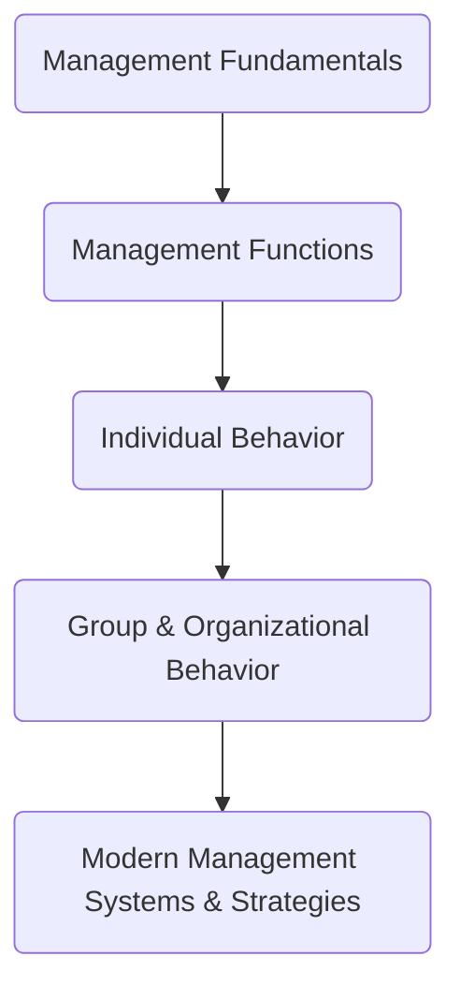

## Course Rationale

The course objectives are to provide students with the foundational knowledge of industrial management principles and practices. It aims to equip them with the skills to effectively manage human resources, production, and operations in an industrial setting.

### Course Outcomes

| S.No. | Course Outcome |
| --- | --- | 
| CO1 | To understand the functions of management, including planning, organizing, staffing, and controlling. |
| CO2 | To apply principles of human resource management, motivation, and leadership. |
| CO3 | To use production management techniques for inventory control and quality management. |
| CO4 | To analyze business environments and apply strategic management concepts. |
| CO5 | To understand the legal and ethical responsibilities of an industrial manager. |

### Units Covered

| Unit | Major Theme | Main Areas |
| --- | --- | --- |
| **I** | Introduction | Management concepts, evolution, organization forms, corporate framework |
| **II** | Functions of Management | Planning, organizing, staffing, leading, controlling, productivity |
| **III** | Organizational Behavior | Individual behavior, perception, personality, motivation, learning, work design |
| **IV** | Group Dynamics | Groups, communication, leadership, decision making, conflict, change |
| **V** | Modern Concepts | MBO, MBE, strategy, SWOT, IT, DSS, BPR, ERP, SCM, ABM, globalization |

### Logical progression

The ordering makes the course easier to study because it moves from **what management is → what managers do → how individuals behave → how groups behave → how modern organizations are managed**.